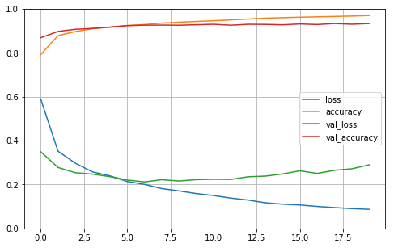

> 本文首发于[牧雨博客](https://www.everains.com/note/ar339.html)
> 
> https://www.everains.com/note/ar339.html

## 问题重述

构建卷积神经网络模型（CNN）对fashion-mnist数据集进行分类(10类)。

## 数据简介

FashionMNIST 是一个替代 [MNIST 手写数字集](https://link.zhihu.com/?target=http%3A//yann.lecun.com/exdb/mnist/)的图像数据集。 它是由 Zalando（一家德国的时尚科技公司）旗下的研究部门提供。其涵盖了来自 10 种类别的共 7 万个不同商品的正面图片,分别是：t-shirt（T恤），trouser（牛仔裤），pullover（套衫），dress（裙子），coat（外套）,sandal（凉鞋），shirt（衬衫），sneaker（运动鞋），bag（包），ankle boot（短靴）。

FashionMNIST 的大小、格式和训练集/测试集划分与原始的 MNIST 完全一致。60000/10000 的训练测试数据划分，28×28 的灰度图片。你可以直接用它来测试你的机器学习和深度学习算法性能，**且不需要改动任何的代码**（实测跑mnist的模型用在fashion上的准确率能到60%）。

这个数据集的样子大致如下（每个类别占三行）：


## 数据读取及预处理

使用Keras模块可以轻松导入

```
from keras.datasets import fashion_mnist

(x_train, y_train), (x_test, y_test) = fashion_mnist.load_data()
x_train = x_train.reshape(x_train.shape[0], 28, 28, 1)/255
x_test = x_test.reshape(x_test.shape[0], 28, 28, 1)/255
y_train = to_categorical(y_train)
y_test = to_categorical(y_test)
```

其中，首先使用reshape函数将x\_train,x\_test张量形状转为(60000, 28, 28, 1),(10000, 28, 28, 1)这一四阶张量,这意味着训练样本数量为60000份测试样本数量为10000份，每张样本图像大小为28\*28。由于每个样本的像素值是0至255之间的值，因此在训练网络之前进行了归一化的操作。

而y\_train,y\_test则存储每个样本所对应的服装种类，用1~10表示。

## 模型建立

模型方面，参考了VGG网络结构\[^1\]，大致特征为：

-   使用连续的小卷积核(3×3)做连续卷积，卷积的固定步长为1，并在图像的边缘填充1个像素，这样卷积后保持图像的分辨率不变。
-   连续的卷积层会接着一个池化层，降低图像的分辨率。空间池化由两个最大池化层进行，并在2×2像素窗口上进行最大池化。
-   卷积层后，接着的是3个全连接层，前两个分别为512、64个通道，第三是输出层输出10个分类。
-   每个隐藏层的激活函数均使用ReLU。
-   使用多次Dropout，以避免多次训练后的过拟合问题（具体表现为损失率后期增高）。

以下为网络详细结构

```
Model: "sequential_1"
______________________________________________________________
Layer (type)                 Output Shape              Param #   
==============================================================
conv2d_6 (Conv2D)            (None, 28, 28, 32)        320       
______________________________________________________________
conv2d_7 (Conv2D)            (None, 28, 28, 32)        9248      
______________________________________________________________
dropout_5 (Dropout)          (None, 28, 28, 32)        0         
______________________________________________________________
conv2d_8 (Conv2D)            (None, 28, 28, 64)        18496     
______________________________________________________________
max_pooling2d_2 (MaxPooling2 (None, 14, 14, 64)        0         
______________________________________________________________
dropout_6 (Dropout)          (None, 14, 14, 64)        0         
______________________________________________________________
conv2d_9 (Conv2D)            (None, 14, 14, 128)       73856     
______________________________________________________________
conv2d_10 (Conv2D)           (None, 14, 14, 128)       147584    
______________________________________________________________
conv2d_11 (Conv2D)           (None, 14, 14, 256)       295168    
______________________________________________________________
max_pooling2d_3 (MaxPooling2 (None, 7, 7, 256)         0         
______________________________________________________________
dropout_7 (Dropout)          (None, 7, 7, 256)         0         
______________________________________________________________
flatten_1 (Flatten)          (None, 12544)             0         
______________________________________________________________
dense_3 (Dense)              (None, 512)               6423040   
______________________________________________________________
dropout_8 (Dropout)          (None, 512)               0         
______________________________________________________________
dense_4 (Dense)              (None, 64)                32832     
______________________________________________________________
dropout_9 (Dropout)          (None, 64)                0         
______________________________________________________________
dense_5 (Dense)              (None, 10)                650       
==============================================================
Total params: 7,001,194
Trainable params: 7,001,194
Non-trainable params: 0
```

## 分析结果



| 训练精度 | 泛化精度 | 训练误差 | 泛化误差 |
| --- | --- | --- | --- |
| 0.9684 | 0.9304 | 0.0909 | 0.2591 |

可以看出，各精度指标均在93%以上，模型较好。

但通过图表可以观察到，在第10次学习后，泛化误差开始明显上升，说明出现过拟合问题，这一点或许可以通过增加Dropout、加大网络深度及降低学习率解决。

## 优化方向

在进行卷积操作时，本模型使用的方法是采用边界填充（Padding）操作，在图像外围填充数值0，再进行卷积操作，经过一次卷积后输出的特征图矩阵与输入的图像矩阵有相同的大小，解决训练深度受限的问题.但此方法会使图像边缘信息模糊，导致在一定程度上降低准确度。而如果在每一步对padding操作进行权重化，根据相关研究，可能将准确度提升至多1.52%\[^2\]。

## 参考

\[^1\]: \[1409.1556\] Very Deep Convolutional Networks for Large-Scale Image Recognition  
\[^2\]: 刘之瑜. 基于Padding权重化的卷积神经网络研究\[J\]. New Generation of Information Technology, 2021, 4(3):14-20.

\[^3\]: https://www.kaggle.com/gpreda/cnn-with-tensorflow-keras-for-fashion Accessed at 2021/10/15